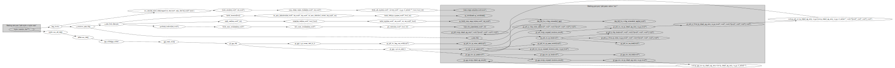
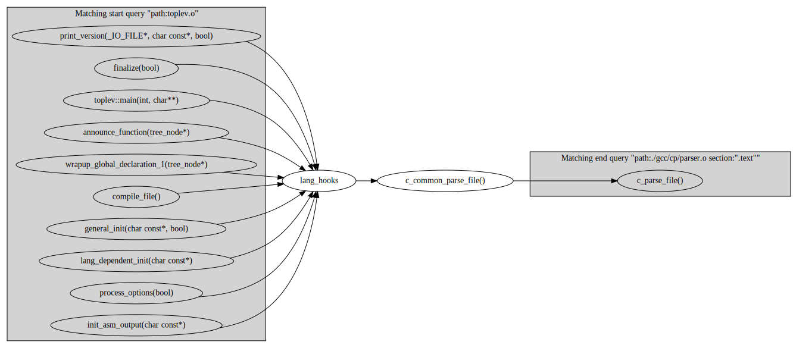

# bdx #

An indexer and graph generator for binary build directories.

This tool can be used to quickly search where an ELF symbol matching some
criteria is defined in a directory and generate graphs for various queries.

Features:

- Parallel, incremental indexing using sharded Xapian database
- Indexes cross-references by analyzing ELF relocations
- Query the database with a simple query language and custom output formats
- Generate symbol reference graphs in DOT format

## Installation ##

With pip:

    pip install .

Or, for development:

    pip install -e .[dev]

For optional graph generation (this installs `pygraphviz`):

    pip install .[graphs]

[xapian][xapian] is required to be installed on the system.

### Getting Xapian ###

You need Xapian Python bindings, you can get them:

1. By installing [**unofficial** Xapian bindings][xapian-bindings] Python
   package with:

        pip install xapian-bindings

2. By running the provided [install_xapian_bindings.sh](./install_xapian_bindings.sh) script
3. By manually downloading and installing them from [Xapian download page][xapian-downloads]

## Usage ##

### Indexing ###

To index a project that contains a `compile_commands.json` file:

    bdx index -c

Or you can specify the directory to index:

    bdx index -d ./build

The indexer will only index files changed since last run.

The `index` command also accepts `-o`, `--opt` option which can be used to set
some indexing settings, e.g. to disable indexing relocations:

    bdx index -d ./build --opt index_relocations=False

Available options:

- `num_processes` - number of parallel indexing processes (default=same as # of
  CPUs).

- `index_relocations` - if True (the default), all relocations will be applied
  and indexed.  Setting this to False can significantly speed up indexing.

- `min_symbol_size` - (default 1) only index symbols with size equal to or
  greater than this.

### Graph generation ###

Generate an SVG image showing at most 20 routes from symbol `main` in
`main.o` to all symbols in section `.text` in files matching wildcard
`Algorithms_*`:

    bdx graph 'main path:main.o' 'section:".text" AND path:Algorithms*' -n 20 | dot -Tsvg > graph.svg

Example graphs:   

By default this generates paths by using the ASTAR algorithm, the `--algorithm
BFS` or `--algorithm DFS` options will use
breadth-first-search/depth-first-search algorithms which can generate different
graphs and can be slower/faster depending on the index and the queries
provided.

### Searching ###

`bdx search` command accepts a query string.  A simple query language is
recognized.

```
$ bdx search  -n 5 tree
tree.o: _Z11count_treesP9tree_node
tree.o: _Z11count_treesP9tree_node
tree.o: _Z11count_treesP9tree_node
tree-eh.o: _ZL20outside_finally_tree8treempleP6gimple
tree-eh.o: _ZL22record_in_finally_tree8treempleP4gtry
```

The `-n` argument sets the maximum number of symbols to search for.

The `-f` argument can be used to set output format (`json`, `sexp` or Python string format spec):

```
$ bdx search  -n 5 -f json tree
{"path": "/src/gcc-12/build/gcc/cp/tree.o", "name": "_Z11count_treesP9tree_node", "section": ".text", "size": 51}
{"path": "/src/gcc-12/build/stage1-gcc/cp/tree.o", "name": "_Z11count_treesP9tree_node", "section": ".text", "size": 50}
{"path": "/src/gcc-12/build/prev-gcc/cp/tree.o", "name": "_Z11count_treesP9tree_node", "section": ".text", "size": 51}
{"path": "/src/gcc-12/build/stage1-gcc/tree-eh.o", "name": "_ZL20outside_finally_tree8treempleP6gimple", "section": ".text", "size": 104}
{"path": "/src/gcc-12/build/gcc/tree-eh.o", "name": "_ZL22record_in_finally_tree8treempleP4gtry", "section": ".text", "size": 415}
$ bdx search -n 5 -f '{size:0>10}|{section:<30}|{name}' tree
0000000051|.text                         |_Z11count_treesP9tree_node
0000000050|.text                         |_Z11count_treesP9tree_node
0000000051|.text                         |_Z11count_treesP9tree_node
0000000104|.text                         |_ZL20outside_finally_tree8treempleP6gimple
0000000415|.text                         |_ZL22record_in_finally_tree8treempleP4gtry
```


#### Examples ####

1. Search for symbols having `foo` AND `bar` somewhere in their name:

        bdx search foo AND bar

    or:

        bdx search foo bar

2. Search for symbols having either `foo` or `bar` in their name:

        bdx search foo OR bar

3. Search for symbols named _exactly_ `foo`:

        bdx search fullname:foo

4. Search for symbols where [Elf ST_INFO type][elf-manpage] is `STT_FUNC` or `STT_OBJECT`:

        bdx search type:FUNC OR type:OBJECT

5. Search for symbols `foo*` in files named `bar.o`:

        bdx search 'name:foo*' path:bar.o

6. Search for symbols `foo` or `bar` that are not mangled (`_Z*` prefix):

        bdx search '(foo OR bar)' AND NOT name:_Z*

7. Search for symbols that reference/call `memset`:

        bdx search relocations:memset

8. Search for symbols that call `malloc`, but not `free`:

        bdx search relocations:malloc NOT relocations:free

9. Search for symbols with size in some range, where address is at least 0xfff0:

        bdx search foo size:100..200 address:0xfff0..

10. Search for symbols by relative path:

        bdx search 'path:./build/module/*'

11. Search for string literals:

        bdx search 'path:"/path/to/File With Spaces.o"'

12. Search for big symbols in some section:

        bdx search section:.rodata AND size:1000..


## License ##

```
Copyright (C) 2024 Michał Krzywkowski

This program is free software: you can redistribute it and/or modify
it under the terms of the GNU General Public License as published by
the Free Software Foundation, either version 3 of the License, or
(at your option) any later version.

This program is distributed in the hope that it will be useful,
but WITHOUT ANY WARRANTY; without even the implied warranty of
MERCHANTABILITY or FITNESS FOR A PARTICULAR PURPOSE.  See the
GNU General Public License for more details.

You should have received a copy of the GNU General Public License
along with this program.  If not, see <https://www.gnu.org/licenses/>.
```
<!-- Local Variables: -->
<!-- coding: utf-8 -->
<!-- fill-column: 79 -->
<!-- indent-tabs-mode: nil -->
<!-- End: -->

[xapian]: https://xapian.org/
[xapian-downloads]: https://xapian.org/download
[xapian-bindings]: https://pypi.org/project/xapian-bindings/
[elf-manpage]: https://manpages.ubuntu.com/manpages/oracular/en/man5/elf.5.html
